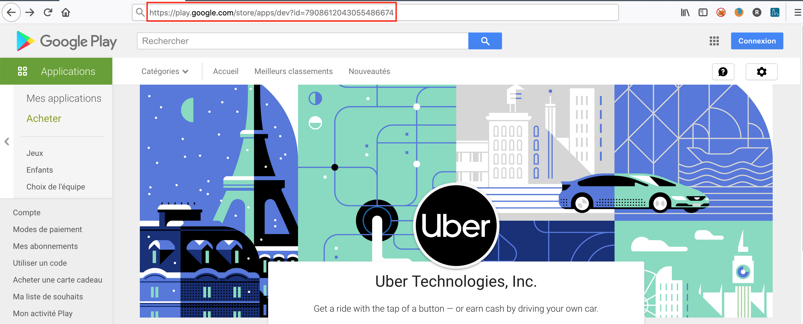

# About EYAPS

**EYAPS** *(Enlarge Your Android Pentest Scope)* was written to perform horizontal enumeration on Android applications
stored on Google Play Store

## Usage

Print the help to get all necessary information

```bash
$ python3 EYAPS.py
usage: EYAPS.py [-h] [--url URL] [--dl]

Android Application horizontal enumeration

optional arguments:
  -h, --help  show this help message and exit
  --url URL   Specify the URL of the Company
  --dl        Download all APK in the current directory
```

The **--url** option is mandatory and represent the URL of the company:

Inline-style: 


Once specified, you just have to wait few seconds to get all applications developed by the company:

```bash
$ python3 EYAPS.py --url https://play.google.com/store/apps/dev?id=7908612043055486674
>> Scrapping associated applications
https://play.google.com/store/apps/details?id=com.uber.restaurantmanager
https://play.google.com/store/apps/details?id=com.ubercab
https://play.google.com/store/apps/details?id=com.postmates.android
https://play.google.com/store/apps/details?id=com.ubercab.eats
https://play.google.com/store/apps/details?id=com.uber.restaurants
https://play.google.com/store/apps/details?id=com.ubercab.fleet
https://play.google.com/store/apps/details?id=com.ubercab.driver
https://play.google.com/store/apps/details?id=com.docebosaas.campusvtc
https://play.google.com/store/apps/details?id=com.ubercab.freight
```

Downloading applications in APK format with the **--dl** option is not yet implemented. Stay tuned!

## Author

Régis SENET ([rsenet](https://github.com/rsenet))

Full article (in French) on ([ORHUS's blog](https://orhus.fr/2021/05/25/enumeration-horizontale-dapplications-sur-google-play-store/))

## Contributing

Bug reports and pull requests are welcome on [GitHub](https://github.com/rsenet/EYAPS).

## License

The project is available as open source under the terms of the [GPLv3](https://www.gnu.org/licenses/quick-guide-gplv3.en.html)
